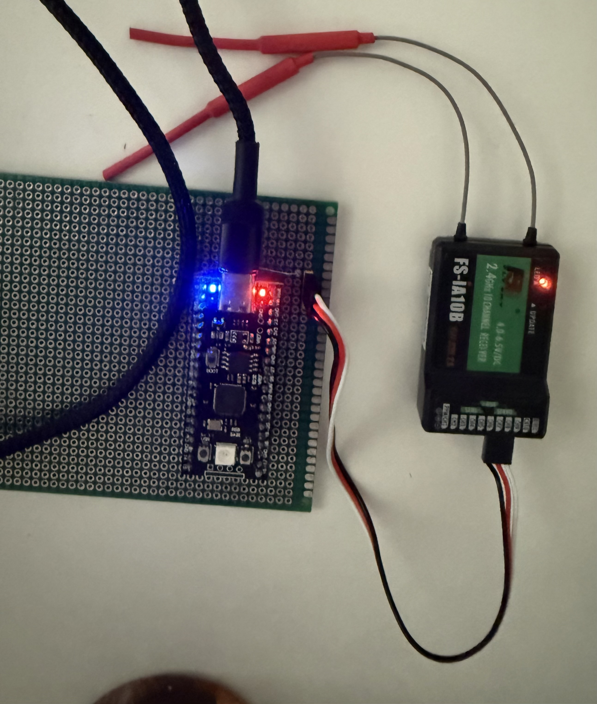
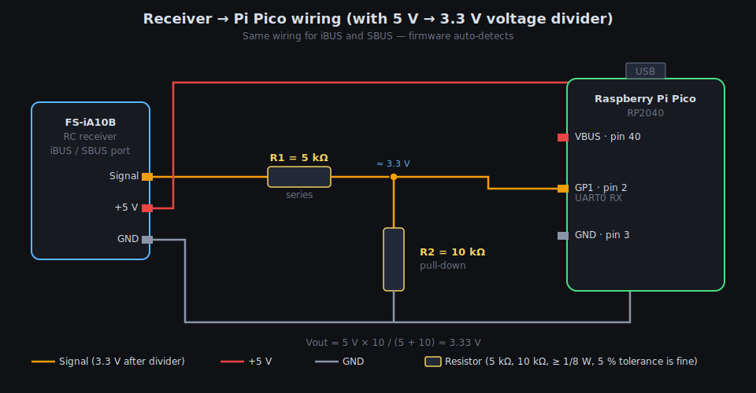
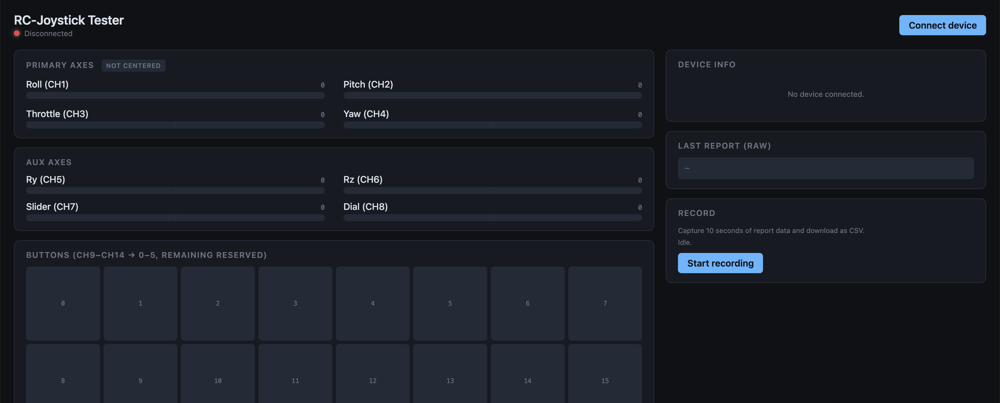

# rc-joystick

Turn a Raspberry Pi Pico (RP2040) into a USB HID joystick that reads an RC
receiver's serial output (iBUS **or** SBUS) and presents itself to a PC/Mac
as a standard game controller — perfect for drone / plane simulators like
**Liftoff**, **Velocidrone**, **DRL Sim**, or **FPV FreeRider**.

The firmware auto-detects iBUS vs SBUS at boot from the same GP1 pin, and
even re-detects live if you swap receivers without unplugging the Pico. Any
receiver speaking either protocol works:

- FlySky FS-iA6B, FS-iA10B, FS-iA8B, X6B, X8B, etc. (iBUS or SBUS)
- Radiolink R7FG, R9DS, R12DS (SBUS)
- FrSky X4R, X8R, R-XSR, X6R (SBUS)
- Any generic receiver with an iBUS or SBUS port

## Features

- **Runtime protocol auto-detect** — one UF2, no build-time flag; boots into
  whichever protocol is on the wire, and re-detects after prolonged failsafe
  so you can swap iBUS ↔ SBUS receivers without power-cycling
- **SBUS with no external inverter** — signal polarity flipped at the GPIO
  pad via the RP2040's built-in `INOVER` field; a plain hardware UART reads
  the (normally inverted) SBUS signal directly
- 8 axes, 16-bit signed each (full ±32767 range → smooth throttle/pitch curves)
- 32 buttons (aux switches CH9+ mapped to buttons 0+ by default)
- Multi-trigger **failsafe**: axes center, throttle to minimum, buttons
  cleared on frame timeout (500 ms), channel freeze (5.5 s), or SBUS
  FAILSAFE/FRAMELOST flag
- **5-state status LED** on GP25 — visually distinguishes booting, waiting,
  wrong-wiring, failsafe, and active states
- USB HID compliant — no drivers needed on Windows, macOS, or Linux

## Hardware

**Board:** Original **Raspberry Pi Pico** (RP2040, micro-USB, on-board green
LED on GP25). Any other RP2040 board with GP25 as the status-LED pin will
also work (YD-RP2040, RP2040-Zero, etc.) — the firmware doesn't rely on
any board-specific pinout.

**Receiver:** any FlySky / Radiolink / FrSky / OrangeRx unit with an iBUS or
SBUS output. Tested with FS-iA6B (iBUS) and FS-iA10B (iBUS + SBUS) paired
with an FS-i6X transmitter.



Example build: Pi Pico soldered onto a perfboard, three-wire servo cable
running to the FS-iA10B's SBUS port. Voltage-divider resistors sit under
the board; the red/black jumpers going off-frame are the USB power / logic
analyser probes used during bring-up.

## Wiring

Same wiring for iBUS **or** SBUS — the firmware auto-detects which one your
receiver is speaking.



```
Receiver (iBUS or SBUS port)          Raspberry Pi Pico
─────────────────────────────────────────────────────────────
Signal wire ──[5 kΩ]──┬──[10 kΩ]──GND
                      │
                      └───────────→   GP1  (UART0 RX, pin 2)

+5 V (VCC)       ─────────────────→   VBUS (pin 40)
GND              ─────────────────→   GND  (pin 3 or 38)

USB (micro-USB)  ─────────────────→   Host PC / Mac
```

### Voltage divider on the signal wire

Some FlySky receivers (including FS-iA10B in SBUS mode) drive the signal
line at **5 V logic level**, which exceeds the RP2040's 3.3 V input
tolerance and can damage the chip over time. A simple two-resistor divider
brings it safely into range:

```
5 V signal ──[R1 = 5 kΩ]──┬──── GP1 (Pico input)
                          │
                         [R2 = 10 kΩ]
                          │
                         GND
```

Output voltage: `Vout = Vin × R2 / (R1 + R2) = 5 × 10/15 ≈ 3.33 V` — a
clean logic HIGH for the Pico, well under the 3.3 V rail. Signal integrity
is fine at both 100 kHz (SBUS) and 115.2 kHz (iBUS) baud with these values.

If your receiver already outputs at 3.3 V level (some clones and newer
revisions do), you can skip the divider and wire the signal directly to
GP1 — but the divider does no harm either way and is the safer default.

**Do NOT** connect the receiver's 5 V rail to the Pico's 3V3 pin. Use VBUS.
SBUS-specific inversion is handled in the firmware via the RP2040's built-in
GPIO pad inversion — no external inverter chip is needed.

## Status LED (GP25)

All pulse durations are sized so you can visually count the blinks.

| Pattern | Meaning |
|---|---|
| Fast even blink (250 on / 250 off) | Booting / USB not yet enumerated |
| Slow even blink (1000 on / 1000 off) | USB up, no bytes on the wire yet — receiver not connected or unpowered |
| **3 pulses (250/250) + 1500 pause** | Bytes arriving on the wire but no valid iBUS/SBUS frames — wrong pin, wrong protocol, or wrong baud |
| **4 pulses (250/250) + 1500 pause** | Signal lost — failsafe engaged (transmitter off, out of range, or channels frozen) |
| Nearly solid (2500 on / 300 off) | Healthy: valid frames arriving with moving channel values |

### How autodetect works

At power-up the firmware alternates between iBUS (115200 8N1, non-inverted)
and SBUS (100000 8E2, inverted at the GPIO pad) on the same UART, spending
~300 ms on each attempt. As soon as one produces a valid frame it locks in
and the LED transitions from `WAITING` (or `WRONG_WIRING`) to `ACTIVE`.

### Runtime re-detect

If the LED sits in the 4-pulse `FAILSAFE` pattern for more than 10 seconds,
the firmware silently tears down the current protocol and re-runs
detection. This lets you swap iBUS ↔ SBUS receivers on the same GP1 pin
without power-cycling — see the Failsafe section below for the full flow.

### Failsafe

**Triggers** — failsafe engages the moment any of these fire:

- **Frame timeout** — no valid frame for 500 ms (either protocol)
- **Channel freeze** — all channels bit-identical for 5.5 s (iBUS has no
  explicit signal-lost flag; many receivers keep sending frames with held
  values when the TX drops, so we heuristically detect frozen values)
- **SBUS flag** — the FAILSAFE or FRAMELOST bit is set in the SBUS frame
  (nearly instant, no timeout needed)

The 5.5 s freeze threshold lets you hold sticks steady in real flight
without falsely tripping failsafe. Tune via `CHANNEL_FREEZE_MS` in `src/main.c`.

**HID output during failsafe** — the device does NOT disappear from the
host, and the payload stays at **the last real values** received from the
receiver. This is a deliberate change from a "safe zero" style failsafe
because sims like Liftoff would otherwise snap the sticks to center any
time the user held them still long enough to trigger the channel-freeze
detector. Keeping the last values means:

- Hold the sticks steady for 10 seconds → nothing changes; sim keeps
  seeing your held position
- Turn off the transmitter → sim keeps seeing whatever position the sticks
  were last in (the receiver's held-value output)
- Unplug the receiver → sim keeps seeing the last frame from just before
  disconnect

Before the very first valid frame ever arrives (fresh boot, no receiver),
the report is initialised to safe defaults: sticks centered, throttle at
minimum, all buttons off — so the sim never sees uninitialised data.

**Recovery** — as soon as valid frames with changing channel values start
arriving again, the report resumes tracking the sticks on the very next
5 ms send tick.

**Runtime re-detect** — if failsafe persists for > 10 s, the firmware
silently re-runs protocol detection (tears down the current UART setup and
alternates between iBUS and SBUS again). This lets you swap iBUS ↔ SBUS
receivers on the same GP1 pin without power-cycling: unplug the old
receiver, wait ~15 seconds, plug in the new one — the LED goes back to
`ACTIVE` on whichever protocol the new receiver speaks.

## Build

Prerequisites (macOS via Homebrew):

```bash
brew install cmake arm-none-eabi-gcc
```

That's it — the Pico SDK and picotool are bundled as git submodules under
`lib/`, so nothing else needs to be installed system-wide. No environment
variables to set either.

Clone with submodules and build:

```bash
git clone --recurse-submodules https://github.com/akhodeir/RC-Protocol-to-Joystick.git
cd RC-Protocol-to-Joystick

mkdir build && cd build
cmake ..
make -j$(sysctl -n hw.ncpu)
```

If you already cloned without `--recurse-submodules`, pull them in with:

```bash
git submodule update --init --recursive
```

### Using a system-installed Pico SDK instead of the bundled one

If you'd rather use a Pico SDK you already have installed system-wide,
just set `PICO_SDK_PATH` and CMake will honor it:

```bash
export PICO_SDK_PATH="$HOME/pico-sdk"
cmake ..
```

Output: `build/rc_joystick.uf2` (~46 KB).

## Flash

**BOOTSEL method** (works on any RP2040 board):
1. Hold the BOOT button on the Pico
2. Plug in the USB cable
3. Release BOOT — the Pico mounts as an `RPI-RP2` drive
4. Drag `build/rc_joystick.uf2` onto the drive; it will reboot into the new firmware

**picotool method** (Pico already running our firmware):
```bash
picotool load build/rc_joystick.uf2 -f && picotool reboot
```

## Verify

1. Plug in the flashed Pico. The on-board LED (GP25) should blink at the
   fast BOOT cadence during USB enumeration, then slow to the 1 s WAITING
   blink once macOS mounts the HID device — no receiver connected yet.

2. For a sim-styled visualiser tailored to this project, open
   `tools/webhid/rc_joystick.html` in Chrome or Edge — labelled bars for each axis,
   button LEDs, live report rate, and a 10-second CSV recording button.

   

3. Bind the receiver and transmitter (procedure varies by receiver — most
   FlySky receivers: hold the button while powering it, then start bind mode
   on the transmitter). Once bound, the on-board LED enters the healthy
   nearly-solid `ACTIVE` pattern. If the TX drops for > 500 ms or channels
   freeze for > 5.5 s, the LED switches to the 4-pulse `FAILSAFE` pattern
   and the report enters failsafe (throttle to minimum).

## Channel to axis mapping

| RC channel | HID axis    | Typical use      |
|-----------|-------------|------------------|
| CH1       | X           | Roll / Aileron   |
| CH2       | Y           | Pitch / Elevator |
| CH3       | Z           | Throttle         |
| CH4       | Rx          | Yaw / Rudder     |
| CH5       | Ry          | Aux              |
| CH6       | Rz          | Aux              |
| CH7       | Slider      | Aux              |
| CH8       | Dial        | Aux              |
| CH9+      | Buttons 0+  | Switches (threshold at protocol midpoint) |

iBUS exposes 14 channels; SBUS exposes 16. Extras above CH8 appear as
buttons 0 through 5 (iBUS) or 0 through 7 (SBUS).

## Project layout

```
rc-joystick/
├── CMakeLists.txt
├── pico_sdk_import.cmake
├── README.md
├── docs/
│   ├── assembled_board.jpg    Photo of an example build
│   ├── wiring.svg             Wiring diagram (embedded in README)
│   └── webhid.png             Screenshot of the WebHID tester
├── src/
│   ├── main.c                  Main loop, autodetect, scaling, failsafe, LED
│   ├── tusb_config.h           TinyUSB build-time configuration
│   ├── usb_descriptors.c/.h    HID descriptor + TinyUSB callbacks
│   ├── ibus.c/.h               iBUS UART parser (115200 8N1)
│   └── sbus.c/.h               SBUS UART parser (100000 8E2 inverted via pad)
├── tools/
│   └── webhid/
│       └── rc_joystick.html    Custom WebHID tester (Chrome / Edge)
└── lib/                        Git submodules (fetched with --recurse-submodules)
    ├── pico-sdk/               Raspberry Pi Pico C/C++ SDK
    └── picotool/               UF2 packager / device tool
```

## Notable implementation details

- **Pad-level SBUS inversion** — the RP2040 has an `INOVER` field in
  `IO_BANK0_GPIOxx_CTRL` that inverts the peripheral input signal before it
  reaches the UART. `gpio_set_inover(pin, GPIO_OVERRIDE_INVERT)` enables it.
  **Critical:** `gpio_set_function()` writes the whole CTRL register and
  zeroes `INOVER`, so the function must be set *before* the inversion — see
  `sbus_init()` for the correct ordering.
- **Runtime channel-freeze detection** — iBUS has no explicit signal-lost
  flag, so we watch for all channels being bit-identical for > 5.5 s.
  Potentiometer jitter under a real transmitter always drifts at least one
  count within that window; only "TX off with receiver holding" produces a
  perfectly frozen frame.
- **Same-UART protocol swap** — both parsers share `uart0` on GP1. Switching
  protocols requires only `uart_deinit` + `uart_init` at a different baud
  rate plus flipping the pad inversion — the whole operation completes in
  under 1 ms.

## References & prior art

Two open-source projects were studied while building this one, plus one
web tool that proved essential during descriptor debugging. Neither project
is a dependency — they're worth a look if you're extending this project or
want to see how others have solved adjacent problems:

- **[nondebug/webhid-explorer](https://nondebug.github.io/webhid-explorer/)** —
  Live at the linked URL (source: `github.com/nondebug/webhid-explorer`).
  Browser-based WebHID debugger by François Beaufort. Parses the HID report
  descriptor tree, dumps raw input reports as hex, decodes fields per-report.
  **Invaluable for verifying a custom HID descriptor is well-formed** — was
  the single most useful external tool while bringing up this firmware.
- **[wiredopposite/OGX-Mini](https://github.com/wiredopposite/OGX-Mini)** —
  RP2040 firmware that emulates USB gamepads for Xbox / PlayStation / Switch
  consoles. Excellent reference for TinyUSB device-driver patterns and HID
  descriptor construction on the RP2040.
- **[danylog/rpi-pico-fs-ia6](https://github.com/danylog/rpi-pico-fs-ia6)** —
  Arduino-pico project that reads a FlySky FS-iA6 receiver via **PWM**
  (6 separate signal wires) and exposes a joystick. Useful reference for
  channel-to-axis mapping conventions expected by flight simulators.

## Roadmap

- Done: iBUS + SBUS + auto-detect + runtime re-detect + HID + LED + multi-trigger failsafe + WebHID tester
- Later: Persistent per-user axis inversion / mid-point trims via flash
- Later: Optional CDC serial channel for live debugging

## License

GNU General Public License v3.0 — see `LICENSE`.

You are free to use, modify, and redistribute this firmware, but any
derivative works you distribute must also be released under GPL v3.


---
## [Donation] Your support is invaluable to this project!

Countless hours of hard work, prototyping, and investment in tools and materials have gone into making this project a reality. If you appreciate the effort and would like to contribute, your donation will help us continue developing and improving Pi-Fly.

Please consider donating for the project. There were tremendous effort added in this project.
Many prototype boards were built and a lot of tools were purchased to make this project become true.

click image below to start donating :

[

](https://www.paypal.com/donate/?hosted_button_id=LGAC3VKW2A8ZA)

**Important**

Use this project at your own risk.

